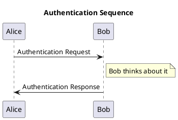

## TEST1:



## TEST2
```plantuml
@startuml C4_Elements
!include https://raw.githubusercontent.com/plantuml-stdlib/C4-PlantUML/master/C4_Container.puml

Person(personAlias, "Label", "Optional Description")
Container(containerAlias, "Label", "Technology", "Optional Description")
System(systemAlias, "Label", "Optional Description")

Rel(personAlias, containerAlias, "Label", "Optional Technology")
@enduml
```


## Text
hello